<!-- AUTO-GENERATED: do not edit directly. -->
# 2026 FIFA World Cup knockout

| Match | Stage | Home | Away | Winner |
| --- | --- | --- | --- | --- |
| R32-01 | round_of_32 | 2A | 2B |  |
| R32-02 | round_of_32 | 1E | 3D/3I/3J/3K/3L |  |
| R32-03 | round_of_32 | 1F | 3C/3E/3H/3I/3J |  |
| R32-04 | round_of_32 | 1C | 3F/3G/3H/3I/3J |  |
| R32-05 | round_of_32 | 1I | 3C/3D/3F/3G/3H |  |
| R32-06 | round_of_32 | 1E | 2I |  |
| R32-07 | round_of_32 | 1A | 3C/3E/3F/3H/3I |  |
| R32-08 | round_of_32 | 1L | 3E/3H/3I/3J/3K |  |
| R32-09 | round_of_32 | 1D | 3B/3E/3F/3I/3J |  |
| R32-10 | round_of_32 | 1G | 3A/3E/3H/3I/3J |  |
| R32-11 | round_of_32 | 2K | 2L |  |
| R32-12 | round_of_32 | 1H | 2J |  |
| R32-13 | round_of_32 | 1B | 3E/3F/3G/3I/3J |  |
| R32-14 | round_of_32 | 1J | 2H |  |
| R32-15 | round_of_32 | 1K | 3A/3B/3D/3E/3F |  |
| R32-16 | round_of_32 | 1A | 2C |  |
| R16-01 | round_of_16 | W-R32-01 | W-R32-02 |  |
| R16-02 | round_of_16 | W-R32-03 | W-R32-04 |  |
| R16-03 | round_of_16 | W-R32-05 | W-R32-06 |  |
| R16-04 | round_of_16 | W-R32-07 | W-R32-08 |  |
| R16-05 | round_of_16 | W-R32-09 | W-R32-10 |  |
| R16-06 | round_of_16 | W-R32-11 | W-R32-12 |  |
| R16-07 | round_of_16 | W-R32-13 | W-R32-14 |  |
| R16-08 | round_of_16 | W-R32-15 | W-R32-16 |  |
| QF-01 | quarter_final | W-R16-01 | W-R16-02 |  |
| QF-02 | quarter_final | W-R16-03 | W-R16-04 |  |
| QF-03 | quarter_final | W-R16-05 | W-R16-06 |  |
| QF-04 | quarter_final | W-R16-07 | W-R16-08 |  |
| SF-01 | semi_final | W-QF-01 | W-QF-02 |  |
| SF-02 | semi_final | W-QF-03 | W-QF-04 |  |
| P3-01 | third_place | L-SF-01 | L-SF-02 |  |
| F-01 | final | W-SF-01 | W-SF-02 |  |

## Mermaid

```mermaid
flowchart LR
  R32_01["R32-01: 2A vs 2B"]
  R32_02["R32-02: 1E vs 3D/3I/3J/3K/3L"]
  R32_03["R32-03: 1F vs 3C/3E/3H/3I/3J"]
  R32_04["R32-04: 1C vs 3F/3G/3H/3I/3J"]
  R32_05["R32-05: 1I vs 3C/3D/3F/3G/3H"]
  R32_06["R32-06: 1E vs 2I"]
  R32_07["R32-07: 1A vs 3C/3E/3F/3H/3I"]
  R32_08["R32-08: 1L vs 3E/3H/3I/3J/3K"]
  R32_09["R32-09: 1D vs 3B/3E/3F/3I/3J"]
  R32_10["R32-10: 1G vs 3A/3E/3H/3I/3J"]
  R32_11["R32-11: 2K vs 2L"]
  R32_12["R32-12: 1H vs 2J"]
  R32_13["R32-13: 1B vs 3E/3F/3G/3I/3J"]
  R32_14["R32-14: 1J vs 2H"]
  R32_15["R32-15: 1K vs 3A/3B/3D/3E/3F"]
  R32_16["R32-16: 1A vs 2C"]
  R16_01["R16-01: W-R32-01 vs W-R32-02"]
  R16_02["R16-02: W-R32-03 vs W-R32-04"]
  R16_03["R16-03: W-R32-05 vs W-R32-06"]
  R16_04["R16-04: W-R32-07 vs W-R32-08"]
  R16_05["R16-05: W-R32-09 vs W-R32-10"]
  R16_06["R16-06: W-R32-11 vs W-R32-12"]
  R16_07["R16-07: W-R32-13 vs W-R32-14"]
  R16_08["R16-08: W-R32-15 vs W-R32-16"]
  QF_01["QF-01: W-R16-01 vs W-R16-02"]
  QF_02["QF-02: W-R16-03 vs W-R16-04"]
  QF_03["QF-03: W-R16-05 vs W-R16-06"]
  QF_04["QF-04: W-R16-07 vs W-R16-08"]
  SF_01["SF-01: W-QF-01 vs W-QF-02"]
  SF_02["SF-02: W-QF-03 vs W-QF-04"]
  P3_01["P3-01: L-SF-01 vs L-SF-02"]
  F_01["F-01: W-SF-01 vs W-SF-02"]
```

